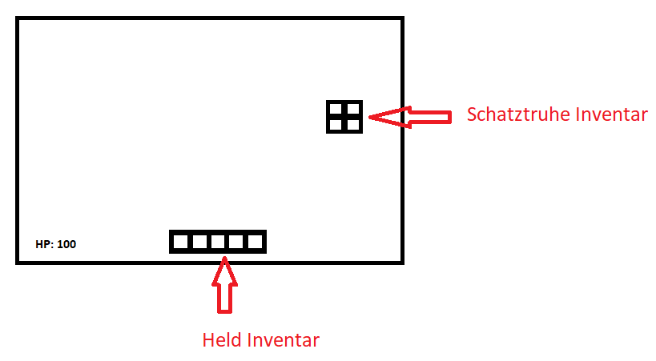
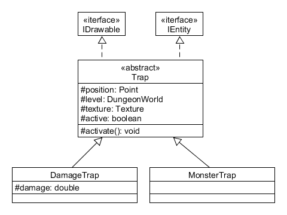

---
title:  'Lerntagebuch zur Bearbeitung von Blatt 4'
author:
- Finn Bechinka (finn.bechinka@fh-bielefeld.de)
- Michel Witt (michel-andre.witt@fh-bielefeld.de)
...

<!--
Führen Sie zu jedem Aufgabenblatt und zum Projekt (Stationen 3-9) ein
Lerntagebuch in Ihrem Team. Kopieren Sie dazu diese Vorlage und füllen
Sie den Kopf entsprechend aus.

Im Lerntagebuch sollen Sie Ihr Vorgehen bei der Bearbeitung des jeweiligen
Aufgabenblattes vom ersten Schritt bis zur Abgabe der Lösung dokumentieren,
d.h. wie sind Sie die gestellte Aufgabe angegangen (und warum), was war
Ihr Plan und auf welche Probleme sind Sie bei der Umsetzung gestoßen und
wie haben Sie diese Probleme gelöst. Beachten Sie die vorgegebene Struktur.
Für jede Abgabe sollte ungefähr eine DIN-A4-Seite Text erstellt werden,
d.h. ca. 400 Wörter umfassen. Wer das Lerntagebuch nur ungenügend führt
oder es gar nicht mit abgibt, bekommt für die betreffende Abgabe 0 Punkte.

Checken Sie das Lerntagebuch mit in Ihr Projekt/Git-Repo ein.

Schreiben Sie den Text mit [Markdown](https://pandoc.org/MANUAL.html#pandocs-markdown).

Geben Sie das Lerntagebuch stets mit ab. Achtung: Wenn Sie Abbildungen
einbetten (etwa UML-Diagramme), denken Sie daran, diese auch abzugeben!

Beachten Sie auch die Hinweise im [Orga "Bewertung der Aufgaben"](pm_orga.html#punkte)
sowie [Praktikumsblatt "Lerntagebuch"](pm_praktikum.html#lerntagebuch).
-->

# Aufgabe 3 HUD, Fallen, Erfahrung und Skill

<!--
Bitte hier die zu lösende Aufgabe kurz in eigenen Worten beschreiben.
-->

## Aufgabe 4.1: HUD  
* Implementieren eines heads-up display
  * Lebenspunkte
  * Inventar
  * Inhalt von Schatztruhen

## Aufgabe 4.2: Erfahrung und Skills 
* Der Held soll durch das besiegen von Monstern EXP bekommen
* Mit genug EXP soll der Held im Level aufsteigen
* Levelfortschritt soll im HUD angezeigt werden
* Level sollen Belohnungen geben z. B.: mehr HP oder Schaden
* Auf Level 2 und 5 soll der Held eine neue Fähigkeit erhalten z. B.: Sprinten oder ein Zauber

## 4.3: Fallen
* Implementieren von Fallen
* Fallen können ausgelöst werden, wenn ein Held oder ein Monster auf sie tritt
* Fallen können verschiedene Wirkungen haben z. B.: Schaden verteilen, den Helden Teleportieren oder neue Monster spawnen
* Fallen können sichtbar oder versteckt sein und nur unter der Wirkung eines Zaubertranks oder Zauberspruchs sichtbar sein
* Fallen können ein oder mehrmals aktivierbar sein

# Ansatz und Modellierung

<!--
Bitte hier den Lösungsansatz kurz beschreiben:
-   Wie sollte die Aufgabe gelöst werden?
-   Welche Techniken wollten Sie einsetzen?
-   Wie sah Ihre Modellierung aus (UML-Diagramm)?
-   Worauf müssen Sie konkret achten?
-->

## Aufgabe 4.1
Für das HUD sollen die HP in Form von Text d. h. z. B. 100HP mithilfe der TextStage Instanz textHUD im MainContoller gezeichnet wird.  
Die angegebenen HP werden durch eine Methode updateHpHud(double hp) aktualisiert, welche von der Held-Klassen aufgerufen wird, wenn der Held Schaden nimmt oder geheilt wird.  
Die Visualisierung des Inventars des Helden und der Kisten werden wir über Implementierungen des IHudElement Interfaces machen.   

)

## Aufgabe 4.2
Der Held bekommt eine variable für sein Level und eine für die gesammelten exp.  
Wenn ein Monster getötet wird, ruft es eine giveExp(int exp) Methode des Helden auf welche dem Helden exp hinzufügt.  
In der update() Methode des Helden wird eine checkForLevelup() Methode aufgerufen welche überprüft, ob der Held geforderten exp für das nächste Level erreicht hat und wenn ja das Level erhöht und die levelup Belohnungen austeilt.  
Auf dem HUD wird das Level und die exp Anforderungen als Text wie die hp ausgegeben, in der Form: Level(gesammelte exp/benötigte exp).

## Aufgabe 4.3
Für die Fallen erstellen wir eine Klasse Trap welche IDrawable und IEntity implementieren.  
Unterschiedliche Fallentypen werden dann als Unterklasse der Trap Klasse implementiert.  

 

# Umsetzung

<!--
Bitte hier die Umsetzung der Lösung kurz beschreiben:
-   Was haben Sie gemacht,
-   an welchem Datum haben sie es gemacht,
-   wie lange hat es gedauert,
-   was war das Ergebnis?
-->

## 08.05.2021  
* Modellierung  
* Aufgabe 4.1
  * HP werden auf dem HUD ausgegeben und aktualisiert
  * Held Inventar wird auf dem HUD ausgegeben
  * Truhen und Taschen Inventar wird auf dem HUD ausgegeben
  * Items können jetzt mit der Maus anstatt von Tastatur eingaben zwischen den verschiedenen Inventaren bewegt werden
* Aufgabe 4.2  
  * Der Held bekommt für getötete Monster exp
  * mit genug exp steigt er im Level auf
  * Level fortschritt wird im hud angezeigt
  * hp werden mit jedem Level erhöht
  * ab Level kann der Spieler sprinten
  * Level 5 Fähigkeit fehlt noch

## 09.05.2021
* Aufgabe 4.2
  * Level 5 Fähigkeit hinzugefügt
* Aufgabe 4.3
  * fertig

# Postmortem

<!--
Bitte blicken Sie auf die Aufgabe, Ihren Lösungsansatz und die Umsetzung
kritisch zurück:
-   Was hat funktioniert, was nicht? Würden Sie noch einmal so vorgehen?
-   Welche Probleme sind bei der Umsetzung Ihres Lösungsansatzes aufgetreten?
-   Wie haben Sie die Probleme letztlich gelöst?
-->

Dieses Mal hat eigentlich alles gut funktioniert, wir sind zwar hier und da von dem was wir geplant hatten leicht abgewichen aber im Großen und Ganzen sind wir zügig vorangekommen ohne auf größere Probleme zu stoßen.