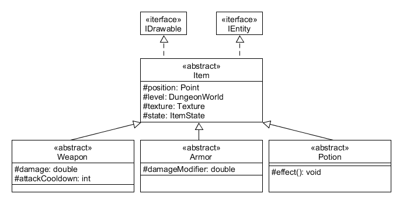

---
title:  'Lerntagebuch zur Bearbeitung von Blatt 3'
author:
- Finn Bechinka (finn.bechinka@fh-bielefeld.de)
- Michel Witt (michel-andre.witt@fh-bielefeld.de)
...

<!--
Führen Sie zu jedem Aufgabenblatt und zum Projekt (Stationen 3-9) ein
Lerntagebuch in Ihrem Team. Kopieren Sie dazu diese Vorlage und füllen
Sie den Kopf entsprechend aus.

Im Lerntagebuch sollen Sie Ihr Vorgehen bei der Bearbeitung des jeweiligen
Aufgabenblattes vom ersten Schritt bis zur Abgabe der Lösung dokumentieren,
d.h. wie sind Sie die gestellte Aufgabe angegangen (und warum), was war
Ihr Plan und auf welche Probleme sind Sie bei der Umsetzung gestoßen und
wie haben Sie diese Probleme gelöst. Beachten Sie die vorgegebene Struktur.
Für jede Abgabe sollte ungefähr eine DIN-A4-Seite Text erstellt werden,
d.h. ca. 400 Wörter umfassen. Wer das Lerntagebuch nur ungenügend führt
oder es gar nicht mit abgibt, bekommt für die betreffende Abgabe 0 Punkte.

Checken Sie das Lerntagebuch mit in Ihr Projekt/Git-Repo ein.

Schreiben Sie den Text mit [Markdown](https://pandoc.org/MANUAL.html#pandocs-markdown).

Geben Sie das Lerntagebuch stets mit ab. Achtung: Wenn Sie Abbildungen
einbetten (etwa UML-Diagramme), denken Sie daran, diese auch abzugeben!

Beachten Sie auch die Hinweise im [Orga "Bewertung der Aufgaben"](pm_orga.html#punkte)
sowie [Praktikumsblatt "Lerntagebuch"](pm_praktikum.html#lerntagebuch).
-->

# Aufgabe 3 Loot, Taschen und Kisten

<!--
Bitte hier die zu lösende Aufgabe kurz in eigenen Worten beschreiben.
-->

## Aufgabe 3.1 Items  
* Unterschiedliche Items implementieren 

## Aufgabe 3.2 Inventar  
* Begrenztes Inventar implementieren
* Items sollen fallengelassen werden können
* Gewisse Items sollen ausgerüstet werden können
  * Ausgerüstete und Items im Inventar wechseln
* Der Held soll aktiv (durch Spiele Eingabe) angreifen können
* Inventar per Tastendruck auf Konsole ausgeben und loggen

## Aufgabe 3.3 Schätze und Taschen
* Schatzkisten implementieren welche im Dungeon verteilt werden
* Schatzkisten haben ein Inventar mit (zufälligen) Items
* Wenn der Held auf einem Nachtbarfeld steht soll das Inventar einer Kiste auf der Konsole ausgegeben werden 
* Taschen implementieren welche mehrere Items eines Typus aufbewahren können

# Ansatz und Modellierung

<!--
Bitte hier den Lösungsansatz kurz beschreiben:
-   Wie sollte die Aufgabe gelöst werden?
-   Welche Techniken wollten Sie einsetzen?
-   Wie sah Ihre Modellierung aus (UML-Diagramm)?
-   Worauf müssen Sie konkret achten?
-->

## Aufgabe 3.1

Für die Items möchten wir eigene Klassen für die eigentlichen Items haben z. B.: Schwert oder Heiltrank welche von einer Klasse, welche den Item-Typ repräsentiert, erben. Also die Schwert-Klasse würde von einer Klasse Waffe erben und der Heiltrank von einer Klasse Trank.  
Diese Item-Typ-Klassen würden nochmal von einer Item-Klasse erben welche alle Items repräsentiert.  

Items können, wenn sie auf dem Boden liegen (z. B.: fallengelassen worden), eine Position haben in dem Level haben. Dann haben sie noch einen Status z. B.: "in einer Schatzkiste" oder "liegt auf dem Boden". Dann hat das Item für den fall dass, das Item auf dem Boden liegt noch eine Textur.

Dann Implementieren wir Waffen, Rüstungen und Tränke.  
Waffen haben einen Schaden welchen sie machen und eine Angriffsgeschwindigkeit (Cooldown in Frames).  
Rüstungen haben einen damage modifier (0 < x < 1) mit welchem dem Helden zugefügter schaden multipliziert wird d.h. dmg * dmgMod = actualDmg z. B.: 50 * 0.5 = 25.  
Tränke haben unterschiedliche Effekte z. B.: Heilung oder speed boost.  

  

## Aufgabe 3.2

Um das Inventar zu repräsentieren bekommt der Held eine arraylist vom Typ Item. Die Inventar große beschränken wir erst einmal auf 5.  
Außerdem bekommt der Held eine variable für eine Rüstung und eine für eine Waffe. Diese repräsentieren die ausgerüsteten Items.   
Der Spieler soll mit dem Drücken von 1 bis 5 einen Inventar-Slot auswählen können, mit 0 ist kein Item ausgewählt.  
Wenn der Spieler E drückt soll das Item in dem momentan ausgewählten Slot ausgerüstet oder benutzt werden.  
Nur ausgerüstete Waffen und Rüstungen haben Einfluss auf den schaden den der Held austeilt oder bekommt.  
Mit I soll das Inventar auf der Konsole ausgegeben werden.  
Mit Leertaste soll der Held angreifen.  

## Aufgabe 3.3

Kisten werden von einer eigenen Kiste-Klasse repräsentiert.  
Wenn der Held kein Item ausgewählt hat und E gedrückt wird soll eine Kiste geöffnet werden, wenn er neben einer steht.  
Kisten haben wie der Held eine arraylist, in welcher die Items gespeichert sind.  
Wenn der Held eine Kiste öffnet kann er hier wieder mit 1b Kisten-Größe ein Item auswählen und mit E aufheben/tauschen.  
Taschen sind ein Item.  
Der Held bekommt einen Ausrüstung-Slot für jede Art von Taschen d. h. er kann jeweils eine Tasche für Waffen, Rüstungen oder Tränke ausrüsten.  
Taschen sind wie Kisten, können aber immer mit einer bestimmten Taste geöffnet werden.  

# Umsetzung

<!--
Bitte hier die Umsetzung der Lösung kurz beschreiben:
-   Was haben Sie gemacht,
-   an welchem Datum haben sie es gemacht,
-   wie lange hat es gedauert,
-   was war das Ergebnis?
-->

## 01.05.2021

* Modellierung
* Aufgabe 3.1
  * Klassen-Struktur fertig
  * Nur ein Beispiel-Item per Typ zum Ausprobieren
* Aufgabe 3.2
  * Held hat inventory
  * Held hat Ausrüstungs-Slots (Waffe und Rüstung)
  * Spieler kann Items droppen
  * Spieler kann Items ausrüsten und diese auch wechseln
  * Ausgerüstete Items haben Effekte
  * Held greift nun nur manuell an

## 02.05.2021

* Aufgabe 3.3
  * Schatzkisten mit zufälligen Items implementiert
    * Spieler kann auf Kiste zugreifen, wenn er neben ihr steht
    * Kisten Inhalt wird auf der Konsole ausgegeben
    * Spieler kann Items aus der Kiste in sein Inventar nehmen
  * Taschen implementiert
    * Taschen nehmen einen Inventarplatz ein
    * Taschen können wie Kisten geöffnet werden
    * Speiler kann Items aus der Tasche entnehmen
    * Spieler kann Items direkt vom Boden in die Tasche aufheben (man kann keine Items aus dem Helden Inventar in Taschen packen)
    * Taschen können nur eine Art von Item halten (Waffe, Trank, etc.)

# Postmortem

<!--
Bitte blicken Sie auf die Aufgabe, Ihren Lösungsansatz und die Umsetzung
kritisch zurück:
-   Was hat funktioniert, was nicht? Würden Sie noch einmal so vorgehen?
-   Welche Probleme sind bei der Umsetzung Ihres Lösungsansatzes aufgetreten?
-   Wie haben Sie die Probleme letztlich gelöst?
-->

Wir haben die aufgaben (größtenteils) wie in der Modellierung beschrieben implementiert.

Wir hatten ein paar Probleme wie genau wir die Navigation, und das aufheben und tauschen von Items, durch das Inventar, Kisten und Taschen gestalten aber naja es funktioniert aber wir werden das wohl nochmal überarbeiten, nachdem wir das HUD (in Blatt 4) implementiert haben damit es sich besser anfühlt. 

Aber was wir auf jeden Fall nochmal machen müssen ist den code "aufzuräumen" was auch Logging, Kommentare und die Dokumentation mit umfasst.