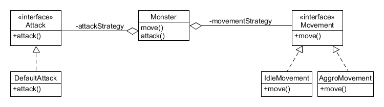

---
title:  'Lerntagebuch zur Bearbeitung von Blatt 6'
author:
- Finn Bechinka (finn.bechinka@fh-bielefeld.de)
- Michel Witt (michel-andre.witt@fh-bielefeld.de)
...

<!--
Führen Sie zu jedem Aufgabenblatt und zum Projekt (Stationen 3-9) ein
Lerntagebuch in Ihrem Team. Kopieren Sie dazu diese Vorlage und füllen
Sie den Kopf entsprechend aus.

Im Lerntagebuch sollen Sie Ihr Vorgehen bei der Bearbeitung des jeweiligen
Aufgabenblattes vom ersten Schritt bis zur Abgabe der Lösung dokumentieren,
d.h. wie sind Sie die gestellte Aufgabe angegangen (und warum), was war
Ihr Plan und auf welche Probleme sind Sie bei der Umsetzung gestoßen und
wie haben Sie diese Probleme gelöst. Beachten Sie die vorgegebene Struktur.
Für jede Abgabe sollte ungefähr eine DIN-A4-Seite Text erstellt werden,
d.h. ca. 400 Wörter umfassen. Wer das Lerntagebuch nur ungenügend führt
oder es gar nicht mit abgibt, bekommt für die betreffende Abgabe 0 Punkte.

Checken Sie das Lerntagebuch mit in Ihr Projekt/Git-Repo ein.

Schreiben Sie den Text mit [Markdown](https://pandoc.org/MANUAL.html#pandocs-markdown).

Geben Sie das Lerntagebuch stets mit ab. Achtung: Wenn Sie Abbildungen
einbetten (etwa UML-Diagramme), denken Sie daran, diese auch abzugeben!

Beachten Sie auch die Hinweise im [Orga "Bewertung der Aufgaben"](pm_orga.html#punkte)
sowie [Praktikumsblatt "Lerntagebuch"](pm_praktikum.html#lerntagebuch).
-->


# Blatt 6 Fernkampf, schlaue Monster und Refactoring

<!--
Bitte hier die zu lösende Aufgabe kurz in eigenen Worten beschreiben.
-->

## Aufgabe 6.1: Fernkampf 
* Fernkampf für Helden und Monster implementieren
* Möglicherweise auch Waffen mit unterschiedlichen Reichweiten

## Aufgabe 6.2: Schlaue Monster
* Mit hilfe des Strategy-Pattern verschiedene Bewegung und Angriffsstrategien für Monster implementieren (mind. 3)
* Ein Monster implementieren welchen zwischen Nah- und Fernkampf wechseln kann

## Aufgabe 6.3: Refactoring
* Projekt aufräumen
* Kommentare/Dokumentation
* OOP-Character bendenken
* In kleinen Schritten vorgehen und für jeden Schritt einen eigenen Commit
* Kollisionserkennung verbessern

# Ansatz und Modellierung

<!--
Bitte hier den Lösungsansatz kurz beschreiben:
-   Wie sollte die Aufgabe gelöst werden?
-   Welche Techniken wollten Sie einsetzen?
-   Wie sah Ihre Modellierung aus (UML-Diagramm)?
-   Worauf müssen Sie konkret achten?
-->

## Aufgabe 6.1: Fernkampf 
Für den Fernkampf werden wir das Kampfsystem so verändern, dass wir nicht mehr die Felder auf welchen der Held und die Monster stehen berücksichtigt werden, sondern die X/Y Koordinaten der Entitäten selber.  
Dadurch können wir flexibel überprüfen, ob die Position eines Monster der Helden Position +- [Nahkampf/Fernkampf-Distanz] entspricht.  
Diese Distanz kann dann Monster, Strategie und Helden Ausrüstung abhängig unterschiedlich sein.  

Grobe Idee:  
```java
boolean isInRange(Character attacker, Character defender){
  double distance = Math.sqrt(Math.pow(defender.x - attackter.x, 2) 
                    + Math.pow(defender.y - attackter.y, 2));

  return (distance >= attacker.minRange && distance >= attacker.maxRange) 
         ? true : false;
}
```
Abgesehen von dieser neuen art zu prüfen ob der gegner in reichweite ist muss an dem rest des Kampssystems nichts verändert werden.  

## Aufgabe 6.2: Schlaue Monster
* Strategie 1
  * Idle
  * Monster bewegt sich zufällig hin und her
* Strategie 2
  * Aggro
  * Wenn das Monster den Helden gesehen hat (keine Wand im weg) bewegt es sich in Richtung des Helden
* Strategie 3
  * Melee Attack
  * Wenn das Monster in Reichweite ist, greift es an
  * Wenn der Held das Sichtfeld des Monsters verlässt bewegt sich das Monster zur zuletzt bekannten Position des Helden

Die Monster bekommen eine Variable welche die letzte bekannte Position des Helden repräsentiert. Diese Variable wird mit null initialisiert und wieder auf null gesetzt, wenn das Monster den Helden nicht wieder finden kann, nachdem es an die letzte bekannte Position gegangen ist.  

Wenn die letzte Position des Helden null ist, wird Strategie 1 verwendet: Das Monster sucht sich eine zufällige Position im Dungeon und bewegt sich dort hin.  

Wenn eine letzte Position des Helden bekannt ist, wird Strategie 2 verwendet: Das Monster bewegt sich in Richtung des Helden.

Sobald der Held in Reichweite des Monsters ist, wird Strategie 3 verwendet: Das Monster greift an und wenn der Held die Reichweite des Monsters verlässt, wechselt es wieder zu Strategie 2.

Für Monster welche zwischen Nah- und Fernkampf wechseln können sollen, wird je nach Entfernung zum Helden der minRange und maxRange variable passende werte zugewiesen. Das Gleiche passiert auch, wenn der Held eine neue Waffe ausrüstet.



## Aufgabe 6.3: Refactoring
* ggf. Unit Tests schreiben
* Die einhaltung von Coding Conventions überprüfen
* Unbenutzten/Mehrfachen code entfernen
* Kommentare/Dokumentation aktuallisieren
* Code leserlicher machen z.B.: variablen namen ausbessern und bedingungen vereifnachen
* Die Klassen Struktur verbessern
* Datenstruktur der Kollisionserkennugn verbessern

# Umsetzung

<!--
Bitte hier die Umsetzung der Lösung kurz beschreiben:
-   Was haben Sie gemacht,
-   an welchem Datum haben sie es gemacht,
-   wie lange hat es gedauert,
-   was war das Ergebnis?
-->

## 29.05.2021
* Lerntagebuch/Modellierung

# Postmortem

<!--
Bitte blicken Sie auf die Aufgabe, Ihren Lösungsansatz und die Umsetzung
kritisch zurück:
-   Was hat funktioniert, was nicht? Würden Sie noch einmal so vorgehen?
-   Welche Probleme sind bei der Umsetzung Ihres Lösungsansatzes aufgetreten?
-   Wie haben Sie die Probleme letztlich gelöst?
-->

